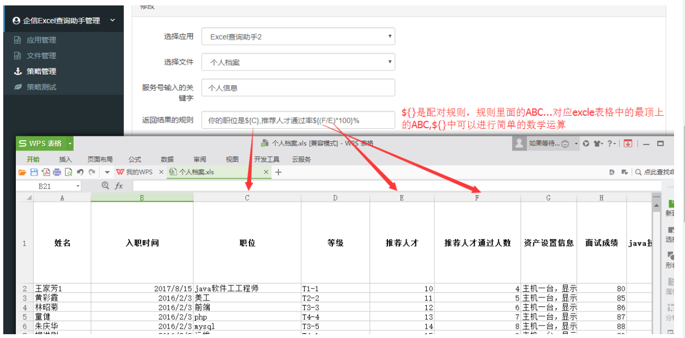

# 接入

## 方式一（只提供链接方式）

**1. 联系管理员，开通账号**

**2. 进入应用，企信excel查询助手管理>应用管理>新增**

**3. 新增完应用后,选择文件管理>新增**

**4. 新增完文件后，选择策略管理>新增**

**5. 测试策略，选择策略进行测试**

!> 一般会选择第一条，中间一条和最后一条进行测试，确保数据正确 

**6. 如何在企信中使用**

>**方式一：回复所有新增的策略消息**

1.  把应用管理下所有策略消息地址复制到服务号素材管理>网页>新增>网页地址

2.  自动回复设置>自动回复规则>关联刚新建的网页素材

3.  效果

>**方式二：回复单条策略消息**

1.  把策略管理下单条策略消息地址复制到服务号素材管理>网页>新增>网页地址

2.  自动回复设置>自动回复规则>关联刚新建的网页素材

3.  效果

## 方式二（服务器接入）

**1. 进入应用，企信excel查询助手管理>应用管理>新增**

> 把你的服务号的名字,appid,AppSecret复制到相应的位置

**2. 服务号开发者模式对接**

> 把生成的token,启用开发者模式地址复制到相应的位置，点击验证，成功后接着下一步

**3. 新增文件,选择文件管理>新增**

**4. 新增完文件后，选择策略管理>新增**

**5. 测试策略，选择策略进行测试**

!> 一般会选择第一条，中间一条和最后一条进行测试，确保数据正确 

**6.如何在企信中使用**

> 直接在企信中输入关键字即可

