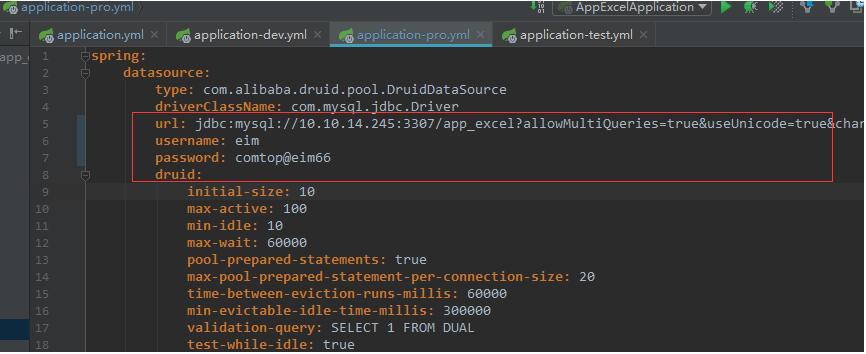

# 部署

 1. 创建数据库app_excel，数据库编码为UTF-8
 
 2. 执行db文件下sql，初始化数据
 3. 修改application.yml文件的spring.profiles.active为pro,启用环境为正式环境
  
 4.  修改application-pro.yml，更新MySQL连接和账号以及密码
 
 
 5. 启动redis,修改application-pro.yml，更新redis连接配置
 
 
 6.  修改application-pro.yml，更新eim.excel下的前四个配置信息
 

 7.  修改resources/static/js/commond.js 文件中baseURL,StrategyInfoURL,developerUrl的值
 

